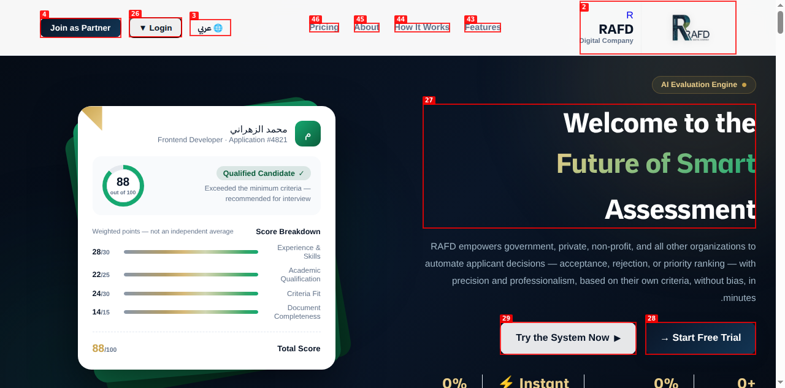
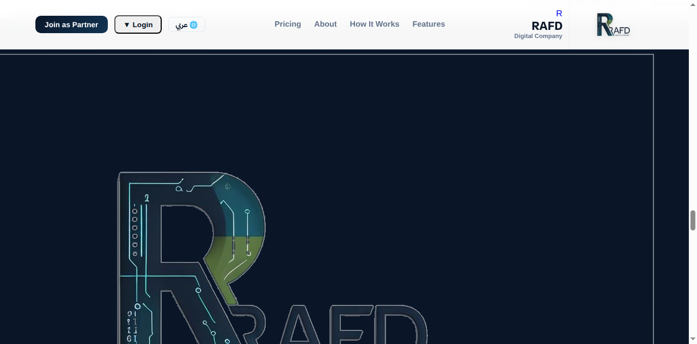
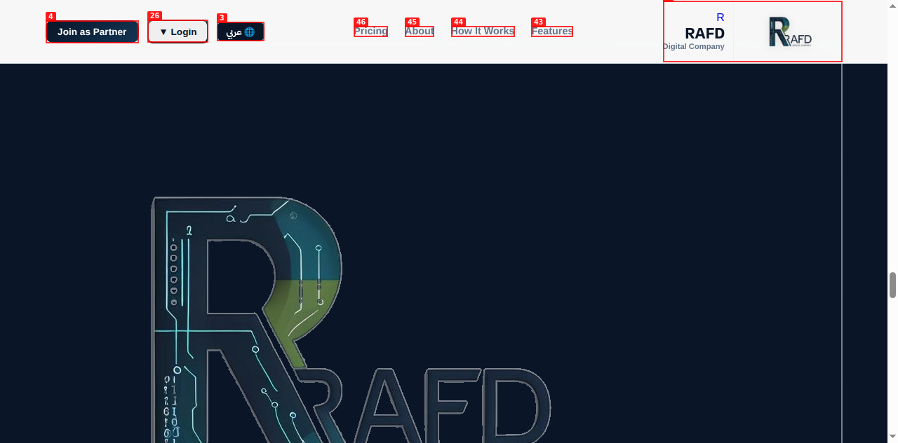
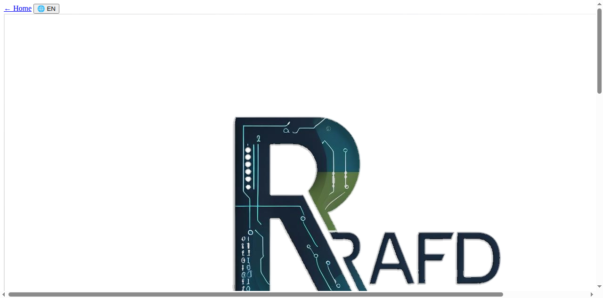

# Dogfood Report: RAFD Digital

| Field | Value |
|-------|-------|
| **Date** | 2026-07-22 |
| **App URL** | http://localhost:3000 |
| **Session** | rafd |
| **Scope** | Full public site (local dev server — serverless functions in `api/` not available) |

## Summary

| Severity | Count |
|----------|-------|
| Critical | 0 |
| High | 2 |
| Medium | 0 |
| Low | 2 |
| **Total** | **4** |

## Issues

> **Status update (same day):** all four issues below were fixed and re-verified in the browser.
> - ISSUE-001 → `html[dir="ltr"] body{direction:ltr}` override added to `style.css` and to the six standalone pages with their own hardcoded `body{direction:rtl}`.
> - ISSUE-002 → `footer.refund` + `chat.whatsapp` i18n keys added (footer link, WhatsApp button title/text). The pricing-page part of this finding was a **false positive**: `pricing.html` already translates prices via `updatePrices()`; it only looked broken locally because ISSUE-003's CSP blocked the inline script.
> - ISSUE-003 → `server.js` CSP now mirrors `vercel.json` (`'unsafe-inline'`, Cloudflare Turnstile hosts, `frame-src`, `font-src data:`).
> - ISSUE-004 → `<title data-i18n="title.*">` added to all 16 i18n pages + `title.*` keys in both `T.ar`/`T.en` (`apply.html` excluded — its title is set dynamically per organization). Bonus fix: duplicated ▼ caret on the pricing-page Login button.
>
> A cross-file consistency sweep after the fixes caught and fixed five more gaps: the LTR override was also needed in `apply.html` and `partner-dashboard.html` (they don't link `style.css`); pre-existing missing i18n keys `su.ph-email` (EN), `db.th-contact` and `db.toast-session-expired` (both languages); and hardcoded untranslated Login buttons in `privacy.html`/`terms.html`.

### ISSUE-001: Entire site stays RTL when language is English

| Field | Value |
|-------|-------|
| **Severity** | high |
| **Category** | visual / i18n |
| **URL** | http://localhost:3000/ (affects all pages) |
| **Repro Video** | N/A (visible on load) |

**Description**

With the language set to English, `i18n.js` correctly sets `<html dir="ltr" lang="en">`, but `style.css:35` hardcodes `body { direction: rtl; }` and no `[dir="ltr"]` override exists anywhere in the stylesheet. Computed `direction` on `<body>` is `rtl` in English mode. As a result all English text is right-aligned with mirrored punctuation — e.g. the hero paragraph renders "…without bias, in **.minutes**" with the period on the wrong side, and arrows/CTA ordering is mirrored.

**Fix direction:** change `style.css` to `html[dir="ltr"] body { direction: ltr; }` (or move `direction` off `body` and rely on the `dir` attribute i18n.js already sets).

**Evidence**

---

### ISSUE-002: Hardcoded Arabic strings leak into English mode (footer + Khalid widget)

| Field | Value |
|-------|-------|
| **Severity** | low |
| **Category** | content / i18n |
| **URL** | http://localhost:3000/ |
| **Repro Video** | N/A (visible on load) |

**Description**

In English mode the footer still shows the Arabic link "سياسة الاسترداد" (refund policy, `index.html:672`) because it has no `data-i18n` attribute, and the Khalid widget's WhatsApp link/title is hardcoded "واتساب" (`index.html:782`, `:897`). All other footer links are translated. The pricing page also leaks Arabic in English mode: the "شهرياً" (monthly) label and the annual-savings lines "4,788 ر.س سنوياً — وفّر 1,200 ر.س" render untranslated (see `screenshots/pricing-en.png`). These strings need i18n keys in both `T.ar` and `T.en`.

**Evidence**

---

### ISSUE-003: Local dev server CSP is stricter than production — kills ALL inline JS and inline styles in local dev

| Field | Value |
|-------|-------|
| **Severity** | high |
| **Category** | functional / dev-prod parity |
| **URL** | all pages served by `node server.js` |
| **Repro Video** | N/A (verified via DOM inspection) |

**Description**

`server.js` sends `Content-Security-Policy: script-src 'self' https://cdn.jsdelivr.net; style-src 'self' https://fonts.googleapis.com; ...` — **without** `'unsafe-inline'` in either directive. Production (`vercel.json`) includes `'unsafe-inline'` in both. The site relies heavily on inline code, so under the local server:

- Every `onclick="..."` attribute is dead — the language toggle, Khalid chat button, login dropdown, and hamburger menu do nothing when clicked (verified: `btn.onclick === null`, wrapping `setLang` recorded zero calls on click).
- Every inline `<script>` block is blocked — `typeof toggleKhalid === "undefined"` on the homepage.
- Every inline `style="..."` attribute is ignored — 136 elements on the homepage, so all `display:none` sections (mobile menu, chat panel contents) render visible.
- Inline `<style>` blocks are blocked — `partner-login.html` (whose entire stylesheet is an inline `<style>` block) renders as completely unstyled raw HTML (see screenshot).

Anyone QA-ing locally will conclude the whole site is broken while production is fine — and conversely, a page that *depends* on the strict local CSP passing would break in production. The two policies should match (either add `'unsafe-inline'` to `server.js` to mirror `vercel.json`, or better, generate both from one source).

**Evidence**

---

### ISSUE-004: Page `<title>` never translated — stays Arabic in English mode

| Field | Value |
|-------|-------|
| **Severity** | low |
| **Category** | content / i18n |
| **URL** | all pages |
| **Repro Video** | N/A |

**Description**

With language set to English (`localStorage rafd_lang = "en"`), every page keeps its Arabic `<title>`, e.g. `apply.html` shows "تقديم الطلب — RAFD Digital" and `pricing.html` shows "الباقات والأسعار — RAFD Digital" in the browser tab. `setLang()` in `i18n.js` translates `[data-i18n]` elements but never touches `document.title`. Add a `title` i18n key per page (or a `data-i18n` handling branch for the `<title>` element).

---
